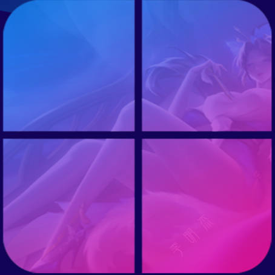

	

    
    

<strong>简体中文</strong>|<a href="README-en.md">English</a>

# STPC 桌面环境

STPC 是一个模拟桌面环境的网页应用。
计划开发方向：提供多种实用工具和应用程序，适用于学习和日常使用。

## 功能特点（以及计划开发方向）

- [ ] **桌面界面**：提供直观的桌面环境。
- [ ] **应用程序**：内置计算器、浏览器、文件管理器、笔记本和终端命令行等常用工具。
- [ ] **系统工具**：包含任务管理器、设置中心、音乐播放器、扫雷游戏等。
- [ ] **个性化**：支持更换背景图片和启动音效。
- [ ] **国际化**：内置翻译插件，支持更多语言。

## 目录结构

- `desktop.html`: 桌面环境的 HTML 文件。
- `icon/logo.png`: 项目图标。
- `img/background.png`: 桌面背景图片。
- `media/startup.mp3`: 启动音效。
- `desktop.css`: 桌面环境的样式表文件。
- `desktop.js`: 实现主要交互功能的函数库。

## 使用方法

- [x] 打开`desktop.html` 文件即可在浏览器中运行桌面环境。
- [ ] 点击桌面图标启动相应的应用程序。
- [ ] 通过设置中心调整个性化选项。

## 贡献指南

欢迎贡献代码或提出建议！

- 贡献代码时请遵循以下步骤：

1. Fork 本仓库。
2. 创建新分支 (`git checkout -b feature/new-feature`)。
3. 提交更改 (`git commit -m 'Add new feature'`)。
4. Push 到分支 (`git push origin feature/new-feature`)。
5. 在平台上提交

**注意：** 不要忘记**说明**一下你的Pull Request！[说明文档模板在这里。](./.gitee/PULL_REQUEST_TEMPLATE.zh-CN.md)

- 提交Issue时请注意：

1. **注意用语**。文明用语，合法用语，严禁骂人、网暴等一切不文明行为和违法违规行为！
2. 我们拒不接受**重复**的Issue。请在提交前自行检查该Issue是否已被他人提交过。

如果您不知道要写什么，请参照[模板文件](./.gitee/ISSUE_TEMPLATE.zh-CN.md)。

## 开源许可证

本项目采用的开源许可证为[EPL-2.0](LICENCE)。请严格遵守开源协议！